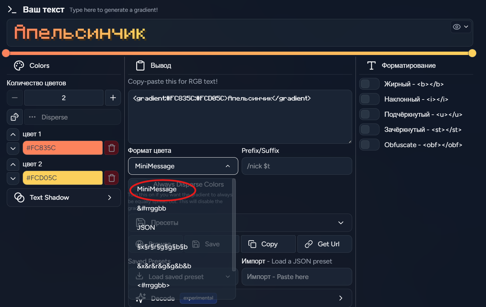
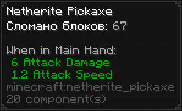

# Донаты

> **В этом разделе мы собрали список визуальных фишек, не влияющих на геймплей, которые можно приобрести на нашем [сайте донатов](https://donate.mkbuilders.ru/).**

---

::heading[Брелки]{level="2" icon="../assets/name-tag.png" iconAlt="Брелки" iconWidth="40"}

Брелок — это особый кастомный предмет, который состоит из двух независимых частей: **Бирки** и **Датчика StatTrack**. Вы можете использовать их как по отдельности на разных предметах, так и повесить обе части на один!

### Бирка

Бирка позволяет покрасить название предмета и изменить его лор (описание). Для этого вам нужно перейти на сайт [Birdflop RGB](https://www.birdflop.com/resources/rgb) и создать свою комбинацию.

**Важное уточнение:** для того чтобы получить правильный тег, в поле «Format» необходимо выбрать «**MiniMessage**».

С полученным тегом из поля «Output» (Вывод) обратитесь к любому администратору на сервере или в Discord, обязательно уточнив, на какой конкретно предмет вы хотите наложить переименование.

### Датчик StatTrack

Датчик позволяет записывать и отображать различную статистику прямо в описании вашего предмета. Доступны следующие виды отслеживаемой статистики:

- Сломано блоков
- Убито существ
- Нанесено урона
- Выпущено снарядов
- Поймано рыбы
- Заблокировано урона

---

## Донатные эффекты

::image{src="../assets/nightmare.png" alt="Эффект Кошмар" width="400"}

Выделитесь из толпы с помощью уникальных визуальных эффектов! Это тематические наборы частиц, которые будут красиво витать вокруг вашего персонажа. Они не создают помех при игре и не меняют хитбоксы, но отлично дополняют ваш игровой образ.

Помимо покупки за реальные деньги, эффекты можно приобрести и за игровую валюту - **клюкву**. Она выдаётся за выполнение заданий временных ивентов и других активностей на сервере. Обменять клюкву можно в магазине по команде `/cranberryshop`, где также отображается ваш текущий баланс. На клюкву доступны любые донатные эффекты, кроме сезонных и эксклюзивных.

---

## Подписки

На проекте существует две ступени подписок: **Звезда** и **Спутник**.
**Спутник** находится выше по иерархии и включает в себя весь функционал Звезды, за исключением её эксклюзивного эффекта.

### Звезда

Базовая подписка, открывающая приятные возможности для кастомизации:

- **Кастомный статус в табе** — выделите себя по-новому.
- **Команда `/hat`** — позволяет надеть любой блок или предмет себе на голову.
- **Эффект «Звезда»** — эксклюзивный эффект, доступный только для этой подписки.

### Спутник

Лучшая подписка, дающая максимум визуальной свободы:

- *Включает весь функционал подписки «Звезда» (кроме эффекта «Звезда»).*
- **Цветной чат** — возможность писать в чате любыми цветами с использованием форматирования MiniMessage.
- **Кастомный никнейм** — полное изменение отображаемого имени (в чате, в табе, в профиле).
- **Эффект «Спутник»** — уникальный косметический эффект, доступный только для этой подписки.

---

::heading[Кастомные пластинки]{level="2" icon="../assets/music-disc.png" iconAlt="Кастомные пластинки" iconWidth="40"}

Кастомные пластинки позволяют записать на них любую свою музыку и прослушивать в игре. Для её прослушивания вам и вашим друзьям потребуется установленный на клиенте мод [PlasmoVoice](https://modrinth.com/plugin/plasmo-voice).

Чтобы записать музыку, нужно иметь обычную пластинку в виде предмета в игре и обратиться к кому-либо из администраторов, чтобы они "нарезали" музыку на вашу пластинку.

---

::heading[Музыкальные рога]{level="2" icon="../assets/goat-horn.png" iconAlt="Музыкальные рога" iconWidth="40"}

Музыкальные (козьи) рога работают по схожему с пластинками принципу, но отлично подходят для коротких звуков, забавных фраз или мемов. На рог можно записать любой аудиофрагмент **длительностью до 10 секунд**.

Как и в случае с пластинками, воспроизведение звука работает через мод [PlasmoVoice](https://modrinth.com/plugin/plasmo-voice), поэтому он должен быть установлен у вас и окружающих игроков.

Для создания такого рога вам понадобится обычный козий рог. Обратитесь к любому администратору сервера, и он поможет записать нужный звук на ваш предмет.
