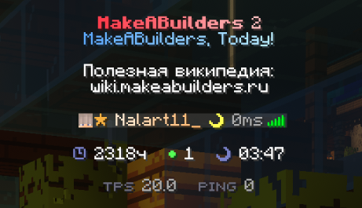
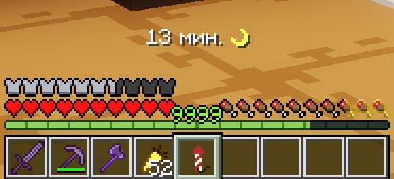

# Афк

Когда игрок отходит от компьютера, остальным сложно понять, отошёл ли он надолго, или уже вот-вот вернётся.
Поэтому, когда вы провели более 2-х минут без какого-либо движения, вас автоматически помечает "Афк".

{width=50%}

Статус в табе автоматически меняется на жёлтую луну, а над вашей головой и у вас над хотбаром отображается время проведенное вами без движения.

{width=50%}

Чтобы не ждать несколько минут есть команда `/afk`, позволяющая сразу же отметиться как отошедшим.
