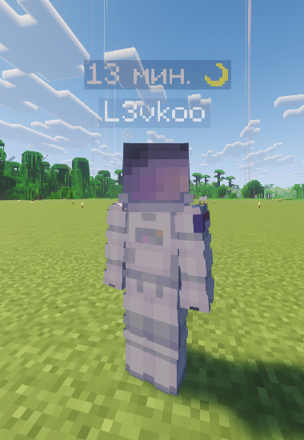

# Афк

Когда игрок отходит от компьютера, остальным сложно понять, отошёл ли он надолго, или уже вот-вот вернётся.
Поэтому, когда вы провели более 2-х минут без какого-либо движения, ваш статус в табе автоматически меняется на жёлтую луну, тем самым обозначая что вы отлучились от игры.

Кроме того, над вашим персонажем в игре появляется табло с информацией о том, сколько часов вы провели в АФК, поэтому остальные сразу поймут, заснули ли вы или просто решили пойти покушать.

Также, есть команда "/afk", которая моментально присваивает вам статус АФК.
