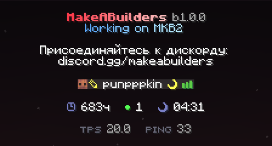

# Афк

Часто, отходя от компьютера по делам, оставляя игру открытой, люди не задумываются о возможных проблемах, связанных с этим. Не всегда со стороны можно понять, отошёл ли человек полностью, занят чем-то или просто игнорирует вас. 
Поэтому, когда вы стоите на месте без какого-либо движения более 2-х минут, вам автоматически выдаётся статус в табе, обозначающий, что вы отошли

Статус афк виден не только в табе, но и прямо над головой игрока, и в его action bar - так что понять, что человек отошёл, можно с одного взгляда, где бы вы ни находились.
