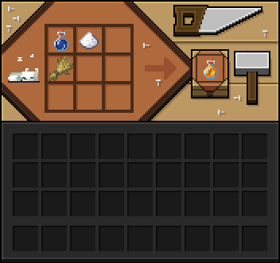

# Варка

Да-да, это правда. Полноценного пивоварения на сервере, конечно, нет, но это не мешает насладиться хмельным напитком с друзьями. Варится пиво прямо на варочной стойке - как обычное зелье, только с кустом (Bush) вместо стандартных ингредиентов. 
И помните: распитие алкогольных напитков вредит вашему здоровью!

## Другие напитки

Помимо пива, на варочной стойке можно приготовить и другие напитки - каждый со своим рецептом и эффектом при употреблении.

### Квасный жмых

Варится из обычной колбы с водой и пшеницы. Это ещё не готовый напиток, а промежуточный продукт - основа для холодного кваса. Пить его напрямую не стоит: жмых слегка отравит вас (Яд I на 5 секунд).

### Холодный квас

Варится из квасного жмыха с добавлением хлеба. Бодрящий хлебный напиток, который на 20 секунд даёт Скорость I - освежает в жару лучше воды.

### Кумыс

Варится из колбы с водой и ведра молока. Даёт Регенерацию II на 15 секунд - самый лечебный из всех напитков варочной стойки.

### Макколли

Варится из колбы с водой и бамбука. Это ещё не готовый напиток, а промежуточный продукт - основа для соджу. Пить его напрямую не стоит: макколли вызовет лёгкую тошноту (Тошнота на 8 секунд, а так же Насыщенность на 3 секунды).

### Соджу

Варится из макколли с добавлением сахара. Бодрящий напиток со своими последствиями, который даёт Замедление I на 10 секунд и Тошноту на 25 секунд, также есть и положительные эффекты Огнестойкость на 15 секунд и Силу I на 45 секунд - самый большой по эффектам напиток.
