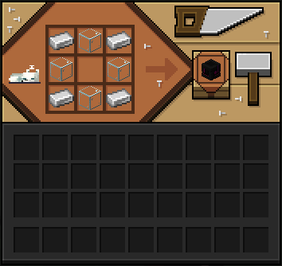
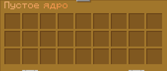
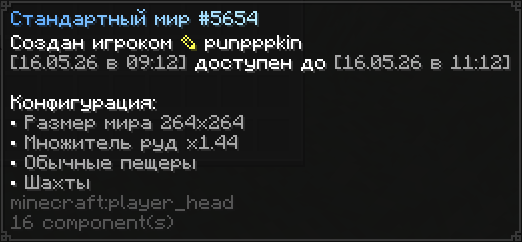

# CaveCraft

Представляем вам Rogue-like Майнкрафт (Отчасти схожий концепцией с 25w14craftmine). Следите за руками:

Сперва, чтобы начать погружение, вам нужно скрафтить "Пустое Ядро"

Само по себе оно не представляет никакого интереса, пустое ведь. Удерживая в руке нажмите пкм, дабы открыть его интерфейс. Ядро, что очевидно, нужно заполнить.

Используются тут как полноценные руды, так и уже вскопанные материалы, а также камень/булыжник, он обязателен (стак минимум). После того, как вы поместили понравившиеся ресурсы внутрь ядра, его нужно выкинуть на землю, проходя метаморфозы, превращаясь в карманное измерение

Все значения рандомизируются случайным образом, но ценность заложенных внутрь ресурсов сильнее влияет на конечный результат. После получения мира он будет существовать лишь какое-то время, так что вы должны успеть забрать столько ресурсов, сколько сможете унести с собой. Важный момент: таймер жизни мира тикает только пока вы находитесь внутри него - можно спокойно выйти и вернуться позже, время не будет уходить впустую. После окончания времени вас насильно выпнут из мира, а при попытке залезть туда вновь измерение попросту исчезнет.

## Ресурсы и очки

Всё, что вы кладёте в ядро, превращается в два вида очков: **очки ценности** (от руд и металлов) и **очки камня** (от каменных блоков). Именно от них зависят характеристики будущего мира.

### Очки ценности

| Ресурс | За предмет или руду | За блок |
| --- | :---: | :---: |
| Уголь | 1 | 9 |
| Медь | 1 | 9 |
| Железо | 3 | 27 |
| Золото | 4 | 36 |
| Изумруд | 5 | 50 |
| Алмаз | 8 | 80 |
| Незерит | 50 | 450 |

Руда, слиток, сырой ресурс - всё считается одинаково. Незерит учитывает слитки, обломки и древние обломки.

### Очки камня

| Блок | Очков за штуку |
| --- | :---: |
| Камень, булыжник, гранит, диорит, андезит, замшелый булыжник | 1 |
| Туф | 2 |
| Дипслейт, булыжный дипслейт | 2 |
| Кальцит, аметист | 3 |
| Обсидиан, плачущий обсидиан | 6 |

:::info{title="Разнообразие выгоднее"}

У каждого ресурса есть порог, после которого новые единицы приносят всё меньше очков. Забить ядро одними алмазами не так эффективно, как вложить разные ценные ресурсы понемногу.

:::

## На что влияют очки

- **Размер мира** - задают очки камня. Базовый мир - 100×100 блоков, и каждые 5 очков камня добавляют по блоку к радиусу, вплоть до гигантских 2000×2000.
- **Богатство руд** - множитель руд (от x0.75 до x2.5) растёт от очков ценности: чем дороже вложенное, тем гуще жилы в мире.
- **Модифицированные пещеры** - если очков ценности очень много или вы засыпали ядро дипслейтом, обычные пещеры сменяются модифицированными.
- **Время жизни** - чем больше всего вложено, тем дольше проживёт мир, но не дольше 24 часов.
- **Особые сооружения** - Древний город, Залы испытаний и Шахты (подробнее ниже).

Среди характеристик мира встречаются и особые сооружения - **Древний город**, **Залы испытаний** и **Шахты**. Выпадают они в зависимости от того, что вы заложили в ядро: скалк и дипслейт тянут за собой Древний город, медь - Залы испытаний, а железо и древесина - Шахты.

:::tip{title="Обещанное - гарантировано"}

Если в описании предмета мира указана структура, она **точно** будет внутри - её больше не придётся искать наугад. Древний город при этом старается появиться в скалковом биоме, чтобы выглядеть максимально естественно. Настроенные структуры теперь гарантированно генерируются в кастомных мирах.

:::

:::info{title="Соклановцы заходят вместе"}

При активации мира все члены вашего клана, находящиеся рядом, телепортируются в него следом за владельцем и получают специальный предмет для возврата обратно.

:::
