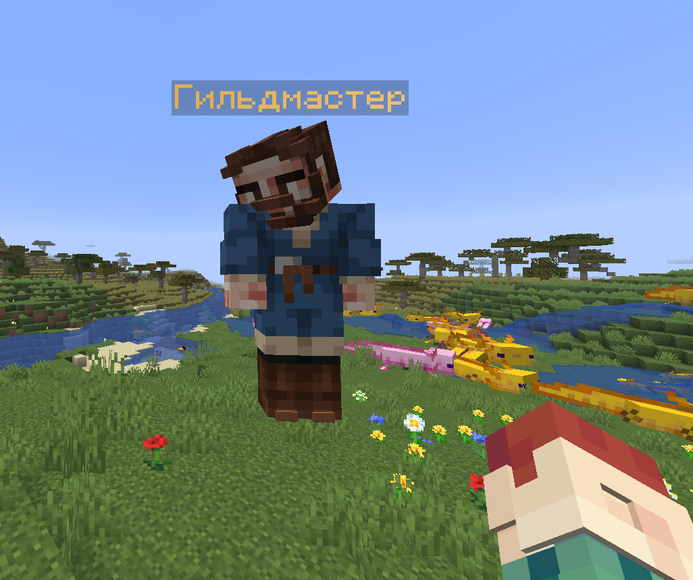
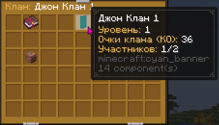
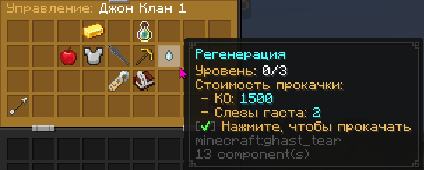

# Кланы

Теперь собираться в группы и играть вместе стало намного легче, ведь появился он, Гильдмастер!

Для создания клана нужно заиметь желаемый флаг и, вместе с ним в руках, подойти к новому НПС.
После создания появится меню вашего сборища, где создатель клана может следить за участниками, прокачкой и навыками.

Помимо простого удобства в обозначении участников одной организации, клановая система предлагает небольшие приятные бонусы за "ОК" (очки клана). Получаются они посредством добычи блоков и/или убийства мобов. На них, в свою очередь, можно купить как активные, так и пассивные свойства: от чуть большей скорости копания до Сопротивления II на короткое время для всех участников в сети.

:::gallery

:::
