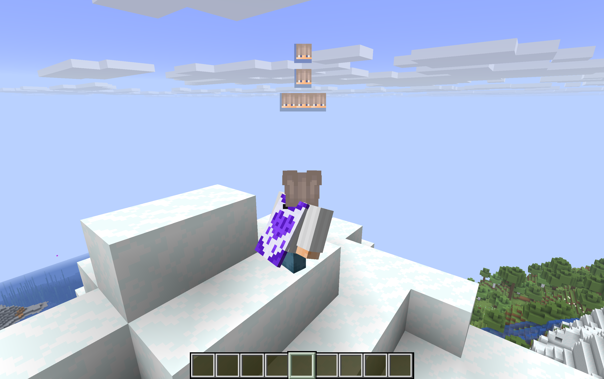
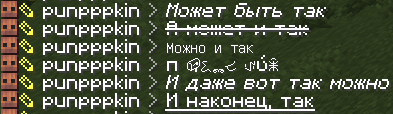

# Эмодзи + Форматирование

В чате, помимо букв, есть и смайлики. Украшайте текст как душе угодно!
Список таковых появляется при нажатии Tab в открытой строке чата

Точно так же для декорирования и/или выделения текста для особой манеры есть форматирование текста. Выделяйте сарказм, увеличивайте напряжение, подчёркивайте неочевидное!

## Таблица форматирования

| Использование в чате | Результат | Описание |
| --- | --- | --- |
| `*Вот так вот*` | *Вот так вот* | Курсив (наклонный) |
| `~~И вот так~~` | ~~И вот так~~ | Зачёркнутый текст |
| \`Либо же вот так\` | `Либо же вот так` | Моноширинный (код) |
| `\|\|Ну или даже так\|\|` | :spoiler[Ну или даже так] | Спойлер (кликните, чтобы открыть) |
| `_И Даже вот так_` | *И Даже вот так* | Альтернативный курсив |
| `__И наконец, так__` | :underline[И наконец, так] | Подчеркнутый текст |

## Действие от третьего лица

Иногда хочется не просто написать, а как бы описать своё действие. Для этого есть команда `/me <текст>` - она выводит в чат сообщение от третьего лица. Например, `/me машет всем рукой` покажется как действие с вашим ником впереди. Отличный способ добавить немного отыгрыша.
