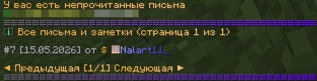
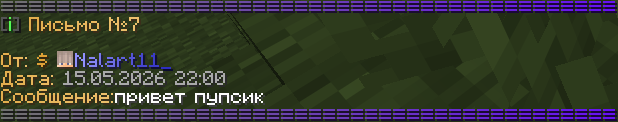

# Мейлы

Ваш друг ушёл, не сказав ни слова, а у вас для него важное сообщение? На сервере появилась возможность отправлять письма тем, кто на данный момент не в сети; человек получит его при следующем входе в игру. Отправлять, получать и пересматривать сообщения можно через команду /mail

