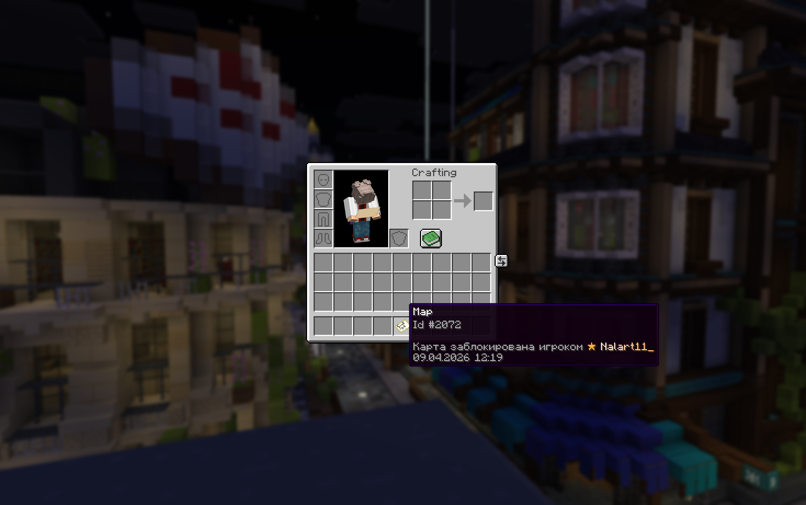
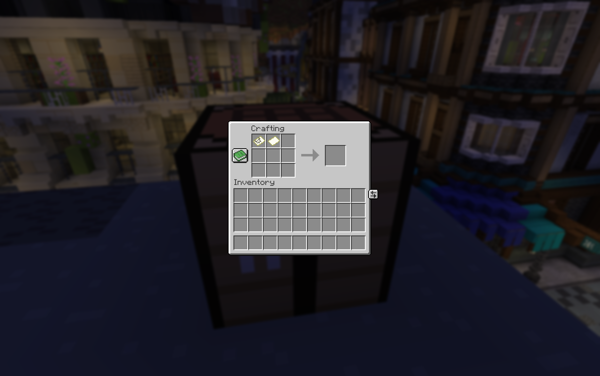
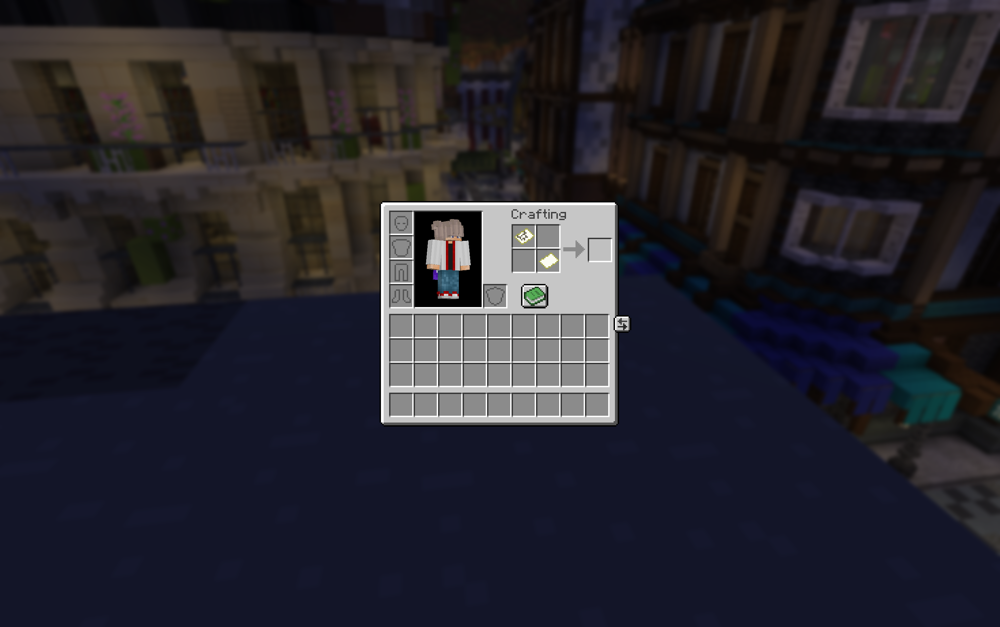
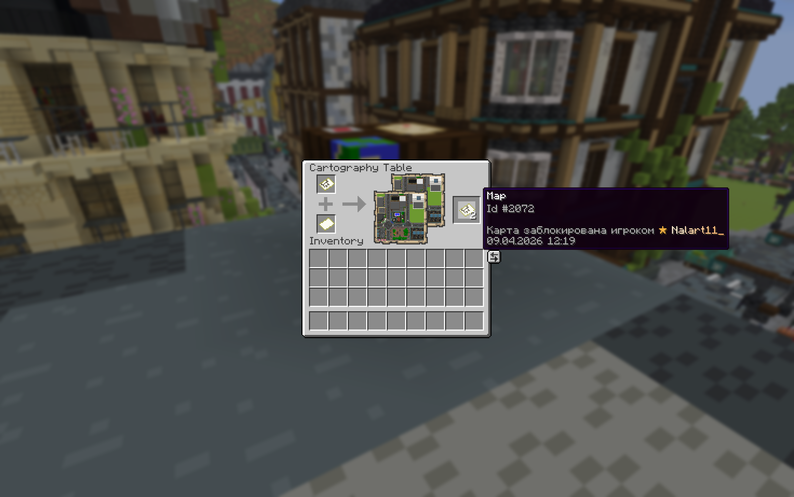
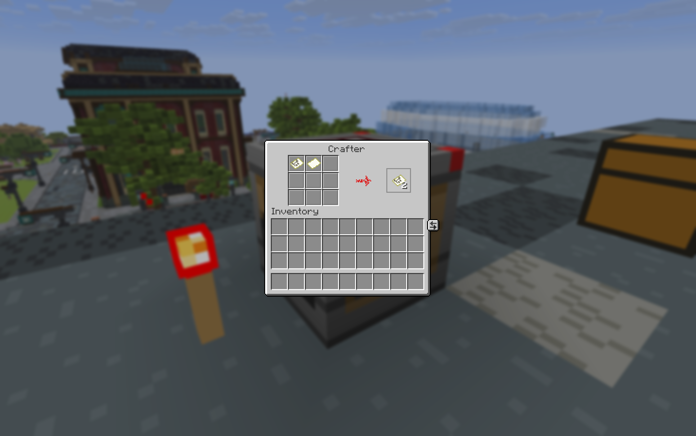

# Мапарты

> Неотъемлемая часть любого сервера с творческим комьюнити. Мы учли, что многие игроки создают арты и хотят не просто делиться ими, но и продавать как полноценный результат своего труда. Рассказываем в этой статье.

:::tip{title="Защита авторов"}

Чтобы защитить авторов мапартов, мы предусмотрели механизм защиты мапартов от копирования.

Если вы выставляете свой арт на продажу, вы можете сделать так, чтобы его нельзя было просто скопировать и распространить бесплатно. Это даёт возможность зарабатывать на творчестве, не боясь, что ваш труд моментально пропадёт даром.

:::

## Блокировка карты

Заблокировать мапарт очень просто. Держите нужную карту в руке и введите команду `/mapart lock`, после этого карта будет защищена от копирования.

Проверить, что мапарт действительно заблокирован, можно прямо в описании предмета: просто наведите курсор на карту в инвентаре, и вы увидите пометку о защите — `Карта заблокирована игроком <ник игрока>` и время блокировки карты:

Такую карту нельзя скопировать, используя верстак, инвентарь, стол картографа или автокрафтер:

:::gallery

:::

## Разблокировка карты

Разблокировать мапарт настолько же просто, насколько и его заблокировать: достаточно использовать команду `/mapart unlock` с картой, заблокированной вами в руке, и карта вновь станет доступной для копирования!