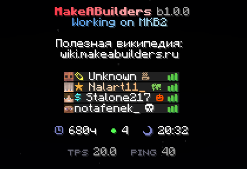

# Статусы

Теперь, дабы выделяться на фоне других, в табе существуют специальные "статусы". Они могут быть как декоративные, так и описывающие ваше времяпрепровождение. Всё управляется через /status

