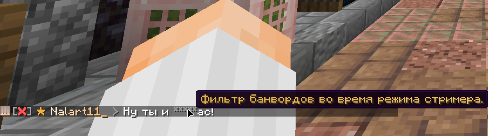

# Режим стримера

Иллюзия безопасности... для стримера

Как вы знаете, у нас на сервере разрешены банворды... а что насчёт стримеров - как им быть?

Всё просто! Специально для стримеров был создан "режим стримера", фильтрующий все сообщения с банвордами в чате. А для членов администрации он дополнительно цензурит весь админ-чат. Всё достаточно просто и прозаично.
