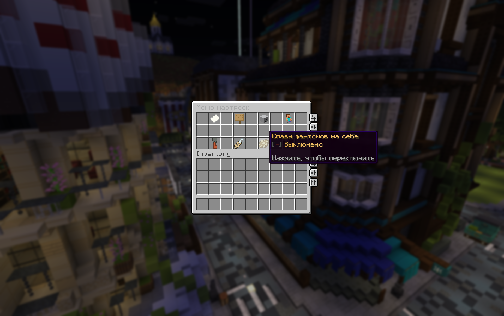

# Тогглы

Небольшой набор функций, которые можно настроить под себя

Иногда хочется отдохнуть ото всех окружающих... и в том числе для этого были сделаны тогглы.
Мы предлагаем вам сборник персональных настроек, помогающих добиться полного комфорта. Эти тогглы свободно переключаются в зависимости от вашего усмотрения.
Можно настроить: 

- Личные сообщения
- Сообщения в чате
- Сообщения о смерти других игроков
- Сообщения о достижениях других игроков
- Сообщения о входе/выходе игроков
- Использование кастомного имени
- Спавн фантомов на себе
- Личные сообщения офлайн-игрокам
- Режим стримера
- Отображение настоящих ников других игроков
- Время отправки сообщений в чате
- Улучшенная рыбалка
- Пинг игроков в табе
- Скорость и угол на элитрах
- Флаг клана в табе
- Босс-бар со статистикой сервера

О последнем пункте вы можете прочитать больше [тут](/feature/streamer-mode)
