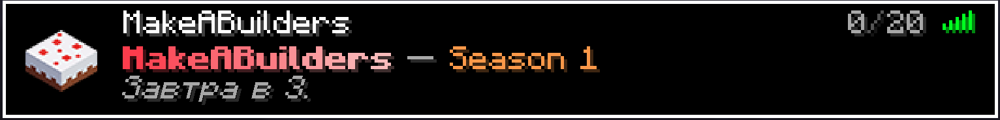
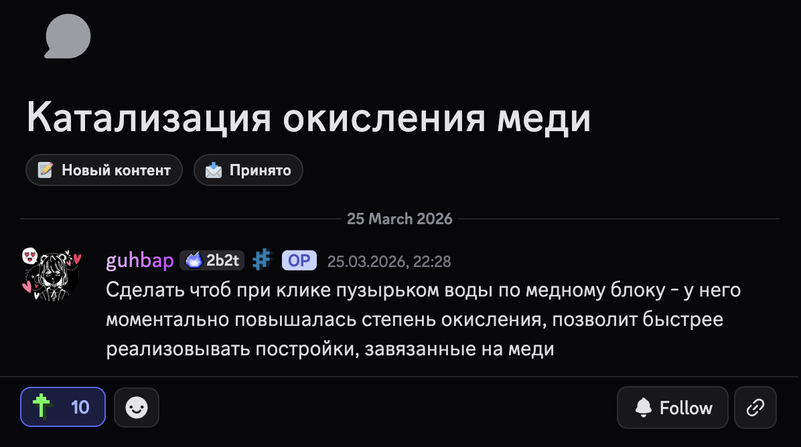

# Привет!

И добро пожаловать в официальную документацию MakeABuilders — нашего главного и самого первого проекта, родившегося из желания некого наларта выучить Java и написать собственные плагины для майнкрафт-сервера. Здесь сосредоточена основная информация о сервере: фишки, различные механики, философия проекта и всё остальное, что делает нас теми, кто мы есть. Присаживайтесь поудобнее, а мы начинаем!

**MakeABuilders — дружеский ванильный лицензионный сервер с живым комьюнити от игроков для игроков, небольшой рп составляющей и собственным ядром, которое отвечает за весь визуал сервера — от MOTD и таба до профиля игрока. Присоединяйтесь, если хотите стать частью большого комьюнити, а не просто ещё одного сервера!**

---

---

## Фишки и свобода действий

Из особых фишек можно выделить возможность изменения роста, ускоренный пропуск ночи, рп-механику выборов в министры общественных территорий и, самое главное — возможность предложить что-то своё. Звучит не густо, но на деле таких мелочей и не мелочей немало, а важнее всего то, что вы можете добавить что-то своё: от окисления меди с помощью бутылочки воды до возвращения сапрессора. Если ваша идея понравится игрокам - считайте, что она уже на сервере.

Отдельно хотелось бы выделить свободу действий на нашем сервере: вы можете делать всё, что угодно, что не мешает либо вредит серверу или другим игрокам в каком-либо виде.

- Самолет-бомбардировщик, оставляющий за собой выжженную полосу земли? Без проблем.
- Адронный коллайдер, основанный на разгоне предметов с помощью льда и воды? Мощь, главное сервер не убейте.

Более подробную информацию о фишках и особенностях MakeABuilders вы можете прочитать в [соответствующем разделе](/feature)

---

## Как начать играть?

**1. Прочитайте общую информацию**

> Для начала прочитайте правила. Нет-нет, да найдёте там что-то, о чём раньше не слышали. Их немного, зато после прочтения точно будете понимать, что можно, а что лучше не делать.
> 
> Настоятельно рекомендуем прочитать пункт про разрешённые и запрещённые моды, с этим у нас строго.

**2. Присоединитесь к [Discord](https://discord.gg/makeabuilders)-серверу**

> Серьёзно, это важно. [Discord](https://discord.gg/makeabuilders) у нас — это основное место жизни проекта. Там выходят все новости, идёт общение комьюнити в текстах и войсах, можно следить за разработкой самописного плагина, задавать вопросы и просто быть в теме. В общем, проще один раз зайти и увидеть всё сами. Кстати, вот ссылка.

**3. Убедись, что ты не дебил**

> Надеемся, вы же не думаете, что этот пункт тут ради прикола? Это главный фильтр в нашем комьюнити - не быть дебилом и, тем более, конченным ублюдком. Если вы проверили и убедились, что не подходите под эти категории, можете проходить дальше.

**4. Зайдите на сервер**

> Да, просто зайдите по айпи. У нас открытый сервер — нужен только лицензионный Minecraft. Не надо подавать, ждать рассмотрения и принятия никаких заявок или покупать проходку. Просто заходите и играйте:
> 
> `mc.mkbuilders.ru`

---

## Наша философия

### Про проект

> Наш проект строится на взаимном уважении, дружеской атмосфере и желании творить вместе.

Мы не против свободного общения, никто не требует сверхвежливости, но и чат в помойку превращать нельзя.

> Администрация и модерация - участники комьюнити, а не карающие судьи и исполнители правил по скрипту.

Но если вы ведёте себя как **ублюдок - ждите того, что с вами будут работать как с ублюдком**. Не будьте ублюдком, и каждую проблему можно будет решить простым разговором.

### О роли игрока в жизни сервера

> Сервер - это **не услуга**, а совместное **комфортное пространство для всех игроков**, где каждый игрок не клиент, а участник в жизни сервера.

Мы не просим идеальности от каждого игрока, но без адекватности такое место не построить.
Относитесь к игрокам так, как хотите, чтобы относились к вам. А если вы хотите, чтобы к вам относились как к конченному ублюдку, то вам мимо.

### Общение и коммуникация

Несмотря на то, что **мат разрешён**, **не стоит превращать чат в помойку**, матерясь через каждое слово. Оскорбления же разрешены лишь по ситуации.

Если вы с кем-то дружите или хорошо общаетесь на одной волне, даже жесткие оскорбления допустимы, если оба участника диалога согласны.

Не стоит приходить на сервер, чтобы сраться, троллить, ломать атмосферу проекта. Всё сводится к простому правилу - **не будьте ублюдком**.

### Администрация и модерация

Как и было сказано ранее,

> *...администрация и модерация - участники комьюнити, а не карающие судьи и исполнители правил по скрипту*

У нас **нет фиксированных сроков наказания**. Каждый срок зависит от контекста, поведения игрока и его отношения. Многие члены администрации открыты к диалогу в личных сообщениях, но уважайте и своё время, и администратора - **пишите конструктивно, если есть проблема**.

### Об изменениях и предложениях

> Любая вещь на сервере может быть изменена.

Если вам кажется, что какое-то правило тупое, какая-то система неудобная или чего-то просто не хватает - кидайте свою идею в предложку. Если сообщество её поддержит, а администрация увидит в этом смысл - мы изменим, добавим или уберём.

> Сервер - это живой организм, и он должен развиваться вместе с игроками

Никакая строчка в правилах или системе не высечена в камне. Всё можно обсудить и поменять, если на это есть веская причина и поддержка игроков.

### К чему это предисловие?

Если вы читали предисловие полностью и внимательно, думаем, вы сами пришли к главной мысли - **не будьте дебилом и уважайте других людей**. Ведите себя по-человечески в любой ситуации, а любые проблемы решаются хорошим диалогом.

Мы **строим комьюнити, а не сервер одноразку**. Свод правил лишь обозначает границы, даёт ответы на многие спорные ситуации, **но не создан для того, чтобы администрация прикрывалась этим сводом**.

В любом хорошем комьюнити должны быть свои красные линии, за которые никто не будет переступать. Но эти красные линии не должны превращаться в забор, внутри которого живёт комьюнити.

**Приятной игры ❤️**
